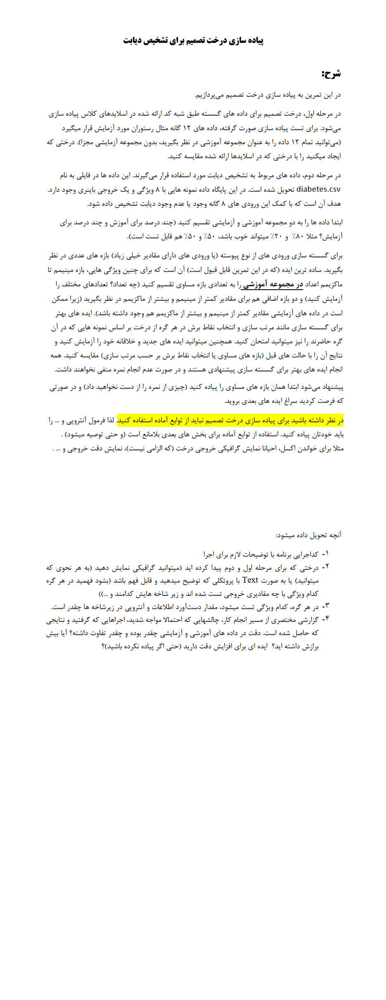

# **💉 Decision Tree Implementation Project for Diabetes Diagnosis | پروژه پیاده‌سازی درخت تصمیم برای تشخیص دیابت**

**A university project designed in Python decision tree for diabetes diagnosis.**

**یک پروژه دانشگاهی که در درخت تصمیم به زبان پایتون برای تشخیص دیابت طراحی می‌شود.**

# 💬 **نکات پروژه**

* عکس‌های خروجی برنامه در دایرکتوری ScreenShots قرار دارند.
* گزارش برنامه در دایرکتوری Report قرار دارد.
* نرم‌افزار مورد نیاز Graphviz در دایرکتوری Software قرار دارد.
* منابع استفاده‌شده در دایرکتوری Sources قرار دارند.
* ورودی برنامه فایل diabetes.csv و نمونه خروجی برنامه در فایل results.txt قرار دارد.
* برای اجرا برنامه، به پایتون بالاتر از نسخه 3.6 نیاز دارید.
* کتابخانه‌های مورد نیاز در فایل requirements.txt قرار دارند.
* برای دسترسی به همه‌ی پروژه‌های دانشگاهی من، به این لینک مراجعه کنید:

👈🏻 **[پروژه‌های دانشگاهی من](https://github.com/bestmahdi2/Uni__Bachelors_SKU_Path)**

# 📝 **توضیحات پروژه**

